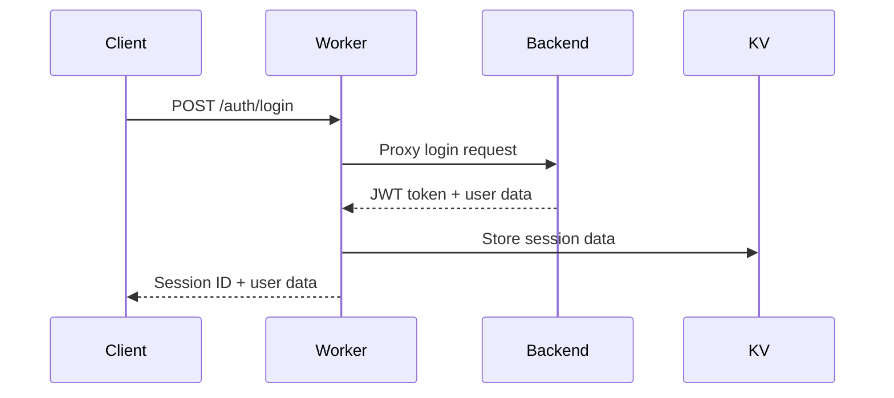
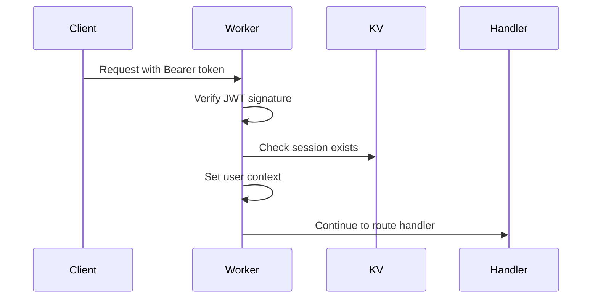

# Authentication System Guide

This guide explains how the authentication system works in the GoReal Cloudflare Workers application.

## Overview

The authentication system uses a hybrid approach:
1. **JWT tokens** for stateless authentication
2. **Cloudflare KV** for session management
3. **Rate limiting** for security
4. **Role-based access control** for authorization

## Architecture

```
Client → Cloudflare Worker → Go Backend
         ↓
    KV Session Store
```

### Components

1. **Auth Middleware** (`src/middleware/auth.ts`)
   - `authMiddleware`: Requires valid authentication
   - `optionalAuthMiddleware`: Optional authentication
   - `adminMiddleware`: Requires admin role
   - `userRateLimiter`: Per-user rate limiting

2. **Auth Routes** (`src/routes/auth.ts`)
   - `/auth/login`: User login
   - `/auth/logout`: User logout
   - `/auth/register`: User registration
   - `/auth/session`: Session validation
   - `/auth/refresh`: Session refresh

3. **Protected Routes** (`src/routes/protected.ts`)
   - `/user/profile`: User profile management
   - `/user/preferences`: User preferences
   - `/user/admin/*`: Admin-only routes

## How It Works

### 1. Login Flow



1. Client sends credentials to `/auth/login`
2. Worker proxies request to Go backend
3. Backend validates credentials and returns JWT + user data
4. Worker creates session in KV store
5. Worker returns session ID to client

### 2. Authentication Flow



1. Client includes `Authorization: Bearer <session-id>` header
2. Middleware verifies JWT token signature
3. Middleware checks if session exists in KV
4. If valid, user context is set for the request
5. Request continues to route handler

### 3. Session Management

Sessions are stored in Cloudflare KV with two keys:
- `session:{user_id}`: Primary session lookup
- `session_id:{session_id}`: Secondary lookup by session ID

Session data includes:
```json
{
  "id": "session-uuid",
  "user": { /* user object */ },
  "created_at": "2024-01-01T00:00:00Z",
  "expires_at": "2024-01-02T00:00:00Z",
  "ip": "1.2.3.4",
  "user_agent": "Mozilla/5.0..."
}
```

## Usage Examples

### 1. Protected Route

```typescript
import { authMiddleware, userRateLimiter } from '../middleware/auth';

app.get('/protected', authMiddleware, userRateLimiter, async (c) => {
  const user = c.get('user') as User;
  return c.json({ message: `Hello, ${user.username}!` });
});
```

### 2. Optional Authentication

```typescript
import { optionalAuthMiddleware } from '../middleware/auth';

app.get('/public', optionalAuthMiddleware, async (c) => {
  const user = c.get('user') as User | undefined;
  const message = user ? `Welcome back, ${user.username}!` : 'Welcome, guest!';
  return c.json({ message });
});
```

### 3. Admin-Only Route

```typescript
import { authMiddleware, adminMiddleware } from '../middleware/auth';

app.get('/admin', authMiddleware, adminMiddleware, async (c) => {
  return c.json({ message: 'Admin access granted' });
});
```

## Client Integration

### Login

```javascript
const response = await fetch('/auth/login', {
  method: 'POST',
  headers: { 'Content-Type': 'application/json' },
  body: JSON.stringify({ email, password })
});

const { data } = await response.json();
const { session_id, user } = data;

// Store session ID for future requests
localStorage.setItem('session_id', session_id);
```

### Making Authenticated Requests

```javascript
const sessionId = localStorage.getItem('session_id');

const response = await fetch('/user/profile', {
  headers: {
    'Authorization': `Bearer ${sessionId}`,
    'Content-Type': 'application/json'
  }
});
```

### Logout

```javascript
const sessionId = localStorage.getItem('session_id');

await fetch('/auth/logout', {
  method: 'POST',
  headers: { 'Authorization': `Bearer ${sessionId}` }
});

localStorage.removeItem('session_id');
```

## Security Features

### 1. JWT Verification
- Cryptographic signature verification using HMAC-SHA256
- Expiration time validation
- Proper base64url decoding

### 2. Session Management
- Sessions stored securely in KV
- Automatic cleanup of expired sessions
- Session invalidation on logout

### 3. Rate Limiting
- Global rate limiting: 100 requests/minute per IP
- User rate limiting: 200 requests/minute per user
- Strict rate limiting: 10 requests/minute for sensitive endpoints
- Upload rate limiting: 5 uploads/minute per user

### 4. Role-Based Access Control
- Admin roles stored in metadata KV
- Middleware enforces role requirements
- Flexible role system

## Configuration

Required environment variables:
```
JWT_SECRET=your-secret-key
GO_BACKEND_URL=http://localhost:8080
```

Required KV namespaces:
- `SESSION_KV`: Session storage
- `METADATA_KV`: User metadata and roles
- `CACHE_KV`: Rate limiting and caching

## Testing

Run the auth tests:
```bash
npm test src/test/auth.test.ts
```

The test suite covers:
- JWT token verification
- Session validation
- Middleware behavior
- Role-based access control

## Troubleshooting

### Common Issues

1. **"Invalid token" errors**
   - Check JWT_SECRET configuration
   - Verify token format (should be base64url encoded)
   - Check token expiration

2. **"Session not found" errors**
   - Verify KV namespace configuration
   - Check session expiration
   - Ensure session was created properly

3. **Rate limiting issues**
   - Check KV namespace for rate limiting
   - Verify IP detection headers
   - Adjust rate limits if needed

### Debug Mode

Enable debug logging by setting:
```
ENVIRONMENT=development
```

This will provide more detailed error messages and logging.
